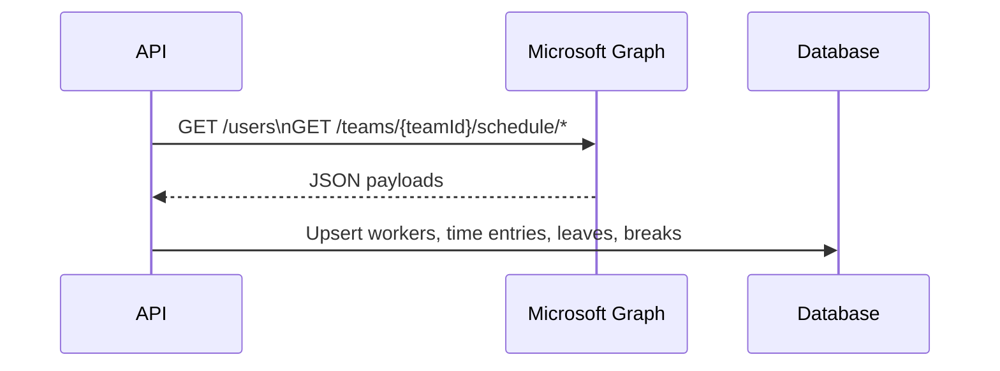

# Timesheet Service

## Overview
The Timesheet service retrieves worker schedules and attendance directly from **Microsoft Teams Shifts** via the Microsoft Graph API. Planned shifts, time cards, time off requests and breaks are fetched from Graph and persisted as **workers**, **time entries**, **leaves** and **breaks**.

- **Language/Framework**: Swift 5, Vapor 4, Fluent
- **Persistence**: PostgreSQL in production, SQLite in tests
- **OpenAPI**: see [`openapi.json`](openapi.json)

## Architecture


## Entities
| Entity | Description |
| ------ | ----------- |
| **Worker** | Employee registry sourced from Microsoft Graph users. |
| **TimeEntry** | Working interval retrieved from Graph time cards. |
| **Leave** | Absence interval coming from Graph time-off requests. |
| **Break** | Pause associated to a `TimeEntry`. |

## Sync Workflow
1. `POST /sync/{teamId}` triggers retrieval from Microsoft Graph.
2. The API fetches users, shifts, time cards and time-off requests for the team.
3. Data is normalized and stored as workers, time entries, leaves and breaks.
4. A background job periodically invokes the same synchronization for configured teams.
5. Consumers query workers and time entries via REST endpoints.

## API Summary
- `POST /workers` – create a worker manually
- `GET /workers` – list workers
- `GET /workers/{id}` – retrieve a worker
- `PUT /workers/{id}` – update a worker
- `DELETE /workers/{id}` – archive a worker
- `POST /workers/{id}/restore` – restore an archived worker
- `GET /workers/{id}/time-entries` – list time entries for a worker
- `POST /sync/{teamId}` – synchronize data from Microsoft Graph for a team

## Environment Variables
| Variable | Description | Default |
| -------- | ----------- | ------- |
| `SERVICE_PORT` | HTTP port | `5555` |
| `SERVICE_NAME` | Service name used in logs | `base-service` |
| `LOG_LEVEL` | Log verbosity | `info` |
| `DB_HOSTNAME` | Database host | `localhost` |
| `DB_PORT` | Database port | `5432` |
| `DB_SCHEMA` | Database name | `test` |
| `DB_USERNAME` | Database user | `postgres` |
| `DB_PASSWORD` | Database password | `postgres` |
| `SQLITE_PATH` | SQLite file path (tests) | `db.sqlite` |
| `REQUESTS_MONGO_STRING` | Connection string for Mongo request logging | `null` |
| `MS_GRAPH_URL` | Base URL of Microsoft Graph | `https://graph.microsoft.com/v1.0` |
| `MS_GRAPH_TENANT_ID` | Azure AD tenant identifier | `null` |
| `MS_GRAPH_CLIENT_ID` | Azure AD application client id | `null` |
| `MS_GRAPH_CLIENT_SECRET` | Azure AD application client secret | `null` |
| `MS_GRAPH_TEAM_IDS` | Comma separated team identifiers for scheduled sync | `""` |

## Microsoft Graph Application Permissions
The Azure AD application used for authentication must be granted the following
Microsoft Graph application permissions:

- `User.Read.All` – allows the service to list users in the tenant
- `Group.Read.All` – enables access to Teams resources
- `Schedule.Read.All` – permits reading shifts, time cards and time-off requests
- `Presence.Read.All` – allows retrieval of user presence information

Without these permissions the synchronization endpoints will not be able to
fetch data from Microsoft Graph.

## Development
1. **Bootstrap**
   ```bash
   swift build
   ```
2. **Run Tests**
   ```bash
   swift test -c debug --enable-code-coverage
   ```
3. **Run Service**
   ```bash
   swift run Run
   ```
