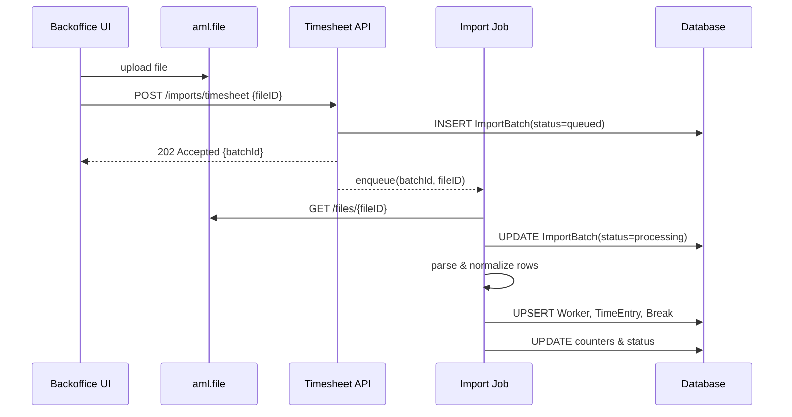
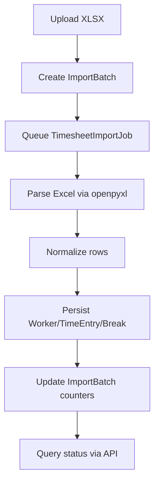

# Timesheet Service

## Overview
The Timesheet service imports working time data exported from **Microsoft Teams Shifts** and exposes a REST API for worker management and reporting. Uploaded spreadsheets are normalized to produce consistent **workers**, **time entries**, **breaks**, and **import batches**.

- **Language/Framework**: Swift 5, Vapor 4, Fluent
- **Persistence**: PostgreSQL in production, SQLite in tests
- **Async processing**: `Job` module hosts a Vapor `AsyncJob` that parses spreadsheets after upload
- **OpenAPI**: see [`openapi.json`](openapi.json)

## Architecture


## Entities
| Entity | Description |
| ------ | ----------- |
| **Worker** | Employee registry. `archivedAt` marks logical deletion. |
| **TimeEntry** | Normalized shift with start/end timestamps. |
| **Break** | Pause associated to a `TimeEntry`. |
| **ImportBatch** | Tracks upload status and processed row counters. |

## Import Workflow
1. The Backoffice uploads the Excel file to **aml.file** obtaining a `fileID`.
2. `POST /imports/timesheet` sends the `fileID` and creates an `ImportBatch` in state `queued`.
3. `TimesheetImportJob` retrieves the file from aml.file, parses it with Python `openpyxl`, normalizes rows and persists workers, entries and breaks.
4. Batch counters (`rowsTotal`, `rowsOk`, `rowsError`) and status are updated.
5. The batch status can be queried via `GET /imports/{batchId}`.

## Normalization Rules
1. Rows are grouped by **worker** and **date**.
2. Rows with a *shift label* create a `TimeEntry` with start/end times.
3. Rows without label but with entry/exit times become `Break` intervals.
4. Breaks are attached to the shift with the **largest overlap**; if a break ends after the shift, the shift end is extended.
5. Unpaid minutes are added to the break duration when both `breakStart` and `breakEnd` are absent.

## API Summary
- `POST /workers` – create a worker
- `GET /workers` – list workers with pagination and filtering
- `GET /workers/{id}` – retrieve a worker
- `PUT /workers/{id}` – update a worker
- `DELETE /workers/{id}` – archive a worker
- `POST /workers/{id}/restore` – restore an archived worker
- `GET /workers/{id}/time-entries` – list time entries for a worker
- `POST /imports/timesheet` – start import referencing a file stored on aml.file
- `GET /imports/{batchId}` – get import batch status

## Environment Variables
| Variable | Description | Default |
| -------- | ----------- | ------- |
| `SERVICE_PORT` | HTTP port | `5555` |
| `SERVICE_NAME` | Service name used in logs | `base-service` |
| `LOG_LEVEL` | Log verbosity | `info` |
| `DB_HOSTNAME` | Database host | `localhost` |
| `DB_PORT` | Database port | `5432` |
| `DB_SCHEMA` | Database name | `test` |
| `DB_USERNAME` | Database user | `postgres` |
| `DB_PASSWORD` | Database password | `postgres` |
| `SQLITE_PATH` | SQLite file path (tests) | `db.sqlite` |
| `REQUESTS_MONGO_STRING` | Connection string for Mongo request logging | `null` |
| `FILE_SERVICE_URL` | Base URL of aml.file service | `http://aml-file` |

## Development
1. **Bootstrap**
   ```bash
   swift build
   ```
2. **Run Tests**
   ```bash
   swift test -c debug --enable-code-coverage
   ```
3. **Run Service**
   ```bash
   swift run Run
   ```
4. **Migrations**
   A single migration `LAB-7` creates all tables related to workers and timesheets.

## Sequence of a Successful Import


## Testing Notes
The end‑to‑end import test is skipped unless `ENABLE_TIMESHEET_E2E=1` and a Python environment with `openpyxl` is available.
