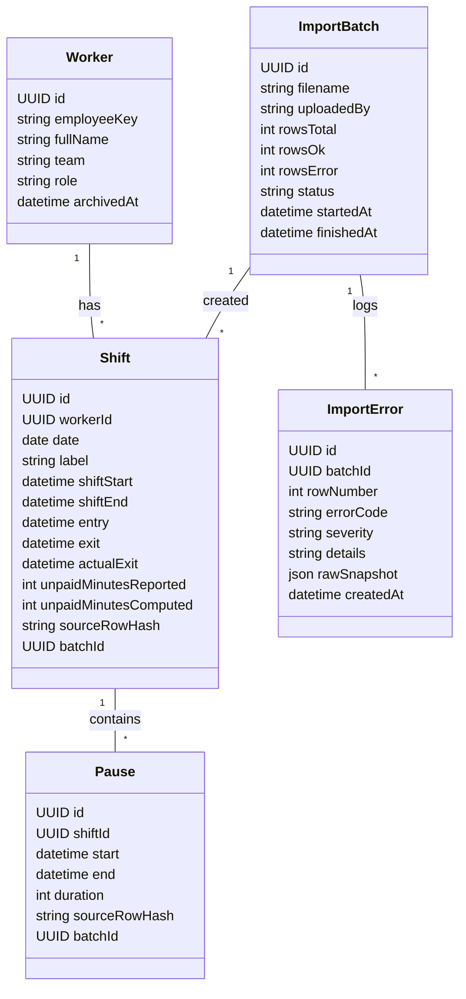
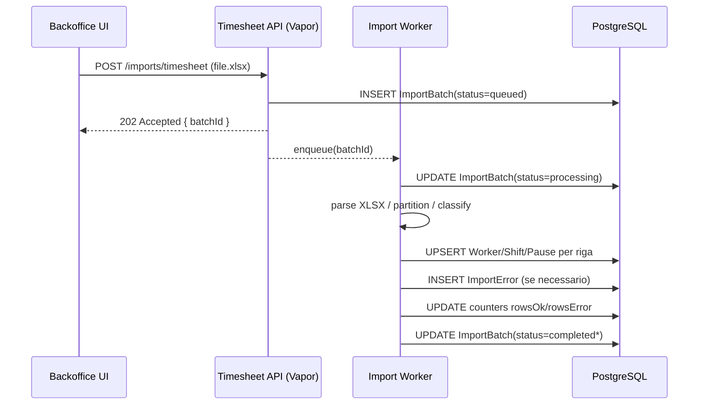

# Introduzione e scopo

Questo microservizio del **dominio Backoffice** riceve via **POST** un file Excel esportato da **Microsoft Teams Shifts**, normalizza i dati orari e li inserisce in un database relazionale. Il servizio è progettato per gestire le **anomalie di registrazione** frequenti (dipendenti che terminano il turno al posto di avviare la pausa, righe con proprietà vuote, duplicazioni) ricostruendo pause e uscite **senza mai modificare o arrotondare** i timestamp originali registrati.

- **Linguaggio & stack**: Swift + Vapor (app/API + worker), **PostgreSQL** in produzione, **SQLite** per test.
- **Tipo di servizio**: Backoffice, **attivo** sull’endpoint di upload, **passivo** nell’elaborazione batch asincrona.
- **Obiettivo**: persistenza coerente e idempotente di **Shift**, **Pause** e **Worker**, tracciando **ImportBatch** e **ImportError** con metriche e audit.
- **Fuori scope**: autenticazione e autorizzazione (gestite dall’infrastruttura Backoffice); esposizione di API pubbliche a partner; orchestrazioni cross‑dominio.

---

# Architettura e componenti

Il servizio è composto da:

**API App (Vapor)**
Espone un endpoint **POST /imports/timesheet** per ricevere l’Excel. Valida il formato (MIME/estensione), apre un record **ImportBatch** in stato `queued`, salva il file in storage (disco/S3) e mette in coda un **job** con `batchId`.

**Worker asincrono**
Processa il batch: parsing dello sheet *Report marcatempo finale*, normalizzazione, deduplica, risoluzione delle anomalie e scrittura su DB. Aggiorna progress e KPI (`rowsTotal`, `rowsOk`, `rowsError`) e chiude il batch (`completed` oppure `completed_with_errors`).

**Database (PostgreSQL)**
Tabelle per **Worker**, **Shift**, **Pause**, **ImportBatch**, **ImportError**. Vincoli di chiave esterna, indici per `(employeeId, date)` e su hash di riga sorgente per idempotenza.

**Observability**
Metriche Prometheus (durata parsing, righe/secondo, error rate, anomalia per codice), structured logging con `batchId`/`rowNumber`, health checks `/health` (liveness/readiness).

---

# Descrizione del funzionamento

Il flusso operativo è volutamente lineare e tollerante agli errori.

**Upload**
Un operatore Backoffice carica il file Excel con POST. L’API restituisce immediatamente `202 Accepted` con `batchId` e stato `queued`.

**Parsing e mapping**
Il worker apre il foglio **«Report marcatempo finale»** e legge le colonne principali:

- `Data`, `Nome del dipendente`, `Etichetta turno`
- `Ora di entrata`, `Ora di uscita`
- `Ora di inizio turno`, `Ora di fine turno`
- `Ore non retribuite` (+ eventuali campi di permessi/assenze / location / note)

Le righe vengono **partizionate per (dipendente, Data)** e ordinate temporalmente. Il worker identifica:

- **Righe turno**: `Etichetta turno` valorizzata **e** *Ora di inizio/fine turno* presenti → creano/aggiornano un **Shift**.
- **Righe anomale (pause mal registrate)**: `Etichetta turno` vuota, *Ora di inizio/fine turno* vuote, ma con `Ora di entrata/uscita` valorizzate → diventano **Pause**.

**Associazione pause → turno (regola «reale, non clamped»)**
Per ogni pausa anomala **B** e per il giorno **D** del dipendente:

1. Si calcola l’**intersezione temporale** tra B (`start=entrata`, `end=uscita`) e ogni **Shift S** del giorno.
2. **Scelta del turno**: si associa B al turno con **overlap maggiore**. Se non esiste alcun overlap (pausa fuori da tutti i turni), si registra **ImportError: ORPHAN\_BREAK**.
3. **Niente arrotondamenti**: si **mantengono sempre** i timestamp originali `start`/`end` della pausa, anche se eccedono l’intervallo del turno; non si clampano agli orari di S.

**Calcolo uscite reali e durate**

- Ogni **Shift** conserva i timestamp del file: `shiftStart`, `shiftEnd`, `entry`, `exit` quando presenti.
- Le **Pause** sono sottratte dal **tempo lavorato** del turno come *somma delle durate delle pause associate* che **intersecano** realmente il turno.
- L’**orario di uscita reale del turno** (`actualExit`) viene **rettificato** per riflettere la sequenza registrata nel file:
  - `actualExit = max( exit (se presente), shiftEnd, max(end di tutte le Pause associate che iniziano dopo shiftStart) )`.
  - Questo consente di correggere i casi in cui l’uscita effettiva cade **dopo** una pausa mal registrata che segue l’orario di fine turno dichiarato.
- Se il file fornisce `Ore non retribuite`, il sistema registra sia il valore **calcolato** dalle Pause sia quello **fornito**; se divergono oltre una soglia (es. 5 minuti) si registra un **warning** in `ImportError` (`UNPAID_MISMATCH`, severità `warn`).

**Multi‑turni nello stesso giorno**
Il modello supporta più **Shift** nello stesso giorno per lo stesso dipendente. La separazione è determinata da `Etichetta turno` e/o dagli intervalli temporali. Le Pause vengono distribuite ai turni per overlap, come sopra.

**Idempotenza e deduplica**
Per ogni riga dello sheet si calcola `sourceRowHash = hash(employeeKey, data, entrata, uscita, inizioTurno, fineTurno, etichetta)`. Le scritture **upsert** evitano duplicati su `(workerId, date, shiftLabel, shiftStart, shiftEnd)` o su `sourceRowHash`.

**Errori tollerati (modalità scelta)**

- Il batch **non** viene annullato per errori di riga.
- Le righe corrette sono importate; le righe errate finiscono in **ImportError** con `rowNumber`, `errorCode`, `details`, `rawSnapshot`.
- Esempi di `errorCode`: `ORPHAN_BREAK`, `INVALID_TIME_RANGE`, `MISSING_EMPLOYEE`, `OVERLAPPING_SHIFTS`, `PARSING_ERROR`, `UNPAID_MISMATCH` (warn).

**Completamento batch**
Al termine, il batch passa a `completed` o `completed_with_errors`, con conteggi e durata. KPI e log sono filtrabili per `batchId`.

---

# Entità principali

## Worker

Rappresenta il dipendente.

- **Chiavi**: `id (UUID)`, `employeeKey` (email/UPN o codice), `fullName`, `team`, `role`, `archivedAt?`.
- **Note**: `employeeKey` è la chiave di partizionamento logica per l’Excel. `archivedAt` abilita la **cancellazione logica** per mantenere la storicità.

## Shift

Turno pianificato/registrato per un Worker in un certo giorno.

- **Attributi**: `id`, `workerId`, `date`, `label` (da *Etichetta turno*), `shiftStart`, `shiftEnd`, `entry` (se presente), `exit` (se presente), `actualExit` (calcolato), `unpaidMinutesReported`, `unpaidMinutesComputed`, `notes`, `sourceRowHash`, `batchId`.
- **Regole**: più Shift nello stesso giorno, differenziati da **label** e/o intervalli.

## Pause

Intervalli di pausa **derivati** da righe anomale.

- **Attributi**: `id`, `shiftId`, `start`, `end`, `duration`, `sourceRowHash`, `batchId`.
- **Regole**: timestamp **non** clamped; possono eccedere l’intervallo del turno; contano solo per la parte che interseca il turno ai fini del calcolo `unpaidMinutesComputed`.

## ImportBatch

Traccia ogni upload.

- **Attributi**: `id`, `filename`, `uploadedBy` (string), `rowsTotal`, `rowsOk`, `rowsError`, `status` (`queued|processing|completed|completed_with_errors|failed`), `startedAt`, `finishedAt`.

## ImportError

Registro errori e warning a livello riga.

- **Attributi**: `id`, `batchId`, `rowNumber`, `errorCode` (enum), `severity` (`error|warn`), `details`, `rawSnapshot` (JSON), `createdAt`.

## Enumerazioni e value objects

- **ErrorCode**: `ORPHAN_BREAK`, `INVALID_TIME_RANGE`, `MISSING_EMPLOYEE`, `OVERLAPPING_SHIFTS`, `PARSING_ERROR`, `UNPAID_MISMATCH`.
- **ImportStatus**: come sopra.
- **TimeRange** (value object): `start`, `end`, metodi di overlap/duration.

---

# Diagramma delle classi (mermaid)



**Descrizione**: il modello separa l’identità del dipendente (**Worker**) dal calendario (**Shift**) e dagli intervalli di inattività (**Pause**). Ogni import è tracciato da **ImportBatch** e le anomalie sono centralizzate in **ImportError**.

---

# Ciclo di vita e interazioni principali

**Sequenza**

1. **POST /imports/timesheet** → crea `ImportBatch(queued)` e risponde con `batchId`.
2. **Worker** preleva `batchId`, apre il file, conteggia `rowsTotal` e passa a `processing`.
3. **Per riga**: parsing → classificazione (Shift|Pause|Errore) → calcolo `sourceRowHash` → **upsert** → aggiornamento counters.
4. **Fine**: `completed` oppure `completed_with_errors`; metriche e log finali.

**Regole temporali**

- Zona oraria configurabile (default: Europe/Rome) con gestione DST.
- Le date `Data` dello sheet sono normalizzate a mezzanotte locale; i `datetime` mantengono offset locale.

**Idempotenza**

- Re‑upload dello stesso file non crea duplicati grazie a `sourceRowHash` e alle chiavi naturali sugli Shift.

**Conservazione del dato originale**

- I valori originali letti dallo sheet sono conservati in `rawSnapshot` per audit.

---

# Algoritmi chiave

**A. Identificazione turni**

- Righe con `Etichetta turno` e `Ora di inizio/fine turno` → creano Shift; se esiste già uno Shift con stessa `(workerId, date, label, shiftStart, shiftEnd)` viene aggiornato `entry/exit` e confrontati `unpaidMinutes*`.

**B. Costruzione pause**

- Righe con etichetta vuota ma `Ora di entrata/uscita` → `Pause(start=entrata,end=uscita)`.
- Associazione al turno per **overlap massimo**, senza clamp.

**C. Calcolo uscite reali**

- `actualExit = max(nonNull(exit, shiftEnd), max(pause.end))` per le pause associate che iniziano dopo `shiftStart`.
- `unpaidMinutesComputed = Σ duration( overlap(pause, [shiftStart, actualExit]) )`.

**D. Errori**

- `ORPHAN_BREAK`: nessun overlap con turni del giorno.
- `INVALID_TIME_RANGE`: `end <= start`.
- `OVERLAPPING_SHIFTS`: due turni con overlap significativo per stesso `(workerId, date)`.
- `UNPAID_MISMATCH(warn)`: differenza tra riportato e calcolato > soglia.

---

# Considerazioni implementative

**Storage file**: inizialmente su filesystem container/persistent volume; interfaccia astratta per passare a S3.

**Parsing Excel**: libreria Swift (es. CoreXLSX). Validazioni progressive per robustezza (tipi datetime, celle vuote, formati locali ITA).

**Migrazioni DB**: create con Fluent. Indici:

- `idx_shift_employee_date` su `(workerId, date)`
- `idx_shift_hash` su `sourceRowHash`
- `idx_pause_shift_start` su `(shiftId, start)`

**Prestazioni**: chunking per 1–5k righe, batch insert, transazioni per gruppo.

**Osservabilità**:

- `import_rows_total`, `import_rows_ok`, `import_rows_error` per batch
- istogrammi per durata parsing e insert
- log con `batchId`, `rowNumber`, `employeeKey`, `date`

**Configurazione**: fuso orario, soglia `UNPAID_MISMATCH_MINUTES` (default 5), label foglio, nome colonne override.

**Sicurezza**: l’endpoint è interno; il servizio **non** implementa autenticazione. Input sanitizzato, size limit (es. 10MB), antivirus opzionale (clamd) prima del parsing.

**Test**: fixture Excel minime (turno semplice; multi‑turno; pause multiple; pause orfane; mismatch non retribuite). Test d’idempotenza su re‑upload.

---

# Diagramma di sequenza (mermaid)



---

# Rischi e mitigazioni

- **Formati data/ora eterogenei**: normalizzazione con locale IT e fallback ISO8601; logging celle problematiche.
- **Righe duplicate**: `sourceRowHash` + chiavi naturali sugli Shift.
- **Pausa che eccede il turno**: ammessa; incide solo per la parte in overlap e aggiorna `actualExit`.
- **Overlapping Shift**: regola di conflitto → errore blocca solo le righe coinvolte.

---

# API: Worker CRUD

Le operazioni CRUD sui dipendenti sono esposte dall’API App.

**Modello Worker (API)**

```json
{
  "id": "UUID",
  "employeeKey": "string",
  "fullName": "string",
  "team": "string|null",
  "role": "string|null",
  "archivedAt": "datetime|null",
  "createdAt": "datetime",
  "updatedAt": "datetime"
}
```

**Endpoint**

- `POST /workers` → crea un dipendente.
  - Body richiesto: `employeeKey`, `fullName` (obbligatori), `team`, `role` (opzionali).
  - Vincoli: `employeeKey` **unico** (case‑insensitive). 409 se duplicato.
- `GET /workers` → lista paginata, con filtri opzionali `q` (search su nome/employeeKey), `team`, `role`, `archived` (true/false), `per`, `page`. Ordine default: `fullName ASC`.
- `GET /workers/{id}` → dettaglio.
- `PUT /workers/{id}` → aggiorna `fullName`, `team`, `role`, e opzionalmente `employeeKey` (se cambia, re‑indicizzazione; 409 su conflitto).
- `DELETE /workers/{id}` → **archiviazione logica** (set `archivedAt=now`). Se esiste almeno uno **Shift** collegato, la cancellazione è comunque logica; la **fisica** non è esposta via API.
- `POST /workers/{id}/restore` → rimuove `archivedAt`.

**Regole**

- I worker archiviati non compaiono di default nella lista (`archived=false` default).
- Un Worker **non può essere eliminato fisicamente** via API; eventuale purge è operazione amministrativa manuale.
- Referenze: gli **Shift** esistenti mantengono il collegamento al Worker anche se archiviato.


# Esempio completo di input e output

## Input (estratto da «Report marcatempo finale»)

| Data       | Nome       | Etichetta turno | Entrata | Uscita | inizio Turno | Fine Turno |       |                             |
| ---------- | ---------- | --------------- | ------- | ------ | ------------ | ---------- | ----- | --------------------------- |
| 2025-07-15 | Luca Verdi | Mattina         | 09:02   | 17:05  | 09:00        | 17:00      | 00:00 | Turno regolare              |
| 2025-07-15 | Luca Verdi |                 | 13:01   | 13:34  |              |            |       | Pausa avviata come «uscita» |
| 2025-07-15 | Luca Verdi |                 | 17:10   | 17:20  |              |            |       | Pausa dopo «fine turno»     |
| 2025-07-16 | Maria Blu  | Mattina         | 05:58   | 12:00  | 06:00        | 12:00      | 00:00 | Turno mattina               |
| 2025-07-16 | Maria Blu  |                 | 10:15   | 10:30  |              |            |       | Pausa registrata male       |
| 2025-07-16 | Maria Blu  | Pomeriggio      | 14:03   | 18:04  | 14:00        | 18:00      | 00:00 | Secondo turno               |
| 2025-07-16 | Maria Blu  |                 | 16:00   | 16:08  |              |            |       | Pausa registrata male       |

## Output DB — Shift

| id   | workerId | date       | label      | shiftStart                | shiftEnd                  | entry                     | exit                      | actualExit                    | unpaidMinutesReported | unpaidMinutesComputed | notes                         | batchId |
| ---- | -------- | ---------- | ---------- | ------------------------- | ------------------------- | ------------------------- | ------------------------- | ----------------------------- | --------------------- | --------------------- | ----------------------------- | ------- |
| S1   | W1       | 2025-07-15 | Mattina    | 2025-07-15T09:00:00+02:00 | 2025-07-15T17:00:00+02:00 | 2025-07-15T09:02:00+02:00 | 2025-07-15T17:05:00+02:00 | **2025-07-15T17:20:00+02:00** | 0                     | **43**                | Pausa post‑fine turno inclusa | B123    |
| S2   | W2       | 2025-07-16 | Mattina    | 2025-07-16T06:00:00+02:00 | 2025-07-16T12:00:00+02:00 | 2025-07-16T05:58:00+02:00 | 2025-07-16T12:00:00+02:00 | 2025-07-16T12:00:00+02:00     | 0                     | 15                    |                               | B123    |
| S3   | W2       | 2025-07-16 | Pomeriggio | 2025-07-16T14:00:00+02:00 | 2025-07-16T18:00:00+02:00 | 2025-07-16T14:03:00+02:00 | 2025-07-16T18:04:00+02:00 | 2025-07-16T18:04:00+02:00     | 0                     | 8                     |                               | B123    |

## Output DB — Pause

| id   | shiftId | start                     | end                       | durationMin | batchId |
| ---- | ------- | ------------------------- | ------------------------- | ----------- | ------- |
| P1   | S1      | 2025-07-15T13:01:00+02:00 | 2025-07-15T13:34:00+02:00 | 33          | B123    |
| P2   | S1      | 2025-07-15T17:10:00+02:00 | 2025-07-15T17:20:00+02:00 | 10          | B123    |
| P3   | S2      | 2025-07-16T10:15:00+02:00 | 2025-07-16T10:30:00+02:00 | 15          | B123    |
| P4   | S3      | 2025-07-16T16:00:00+02:00 | 2025-07-16T16:08:00+02:00 | 8           | B123    |